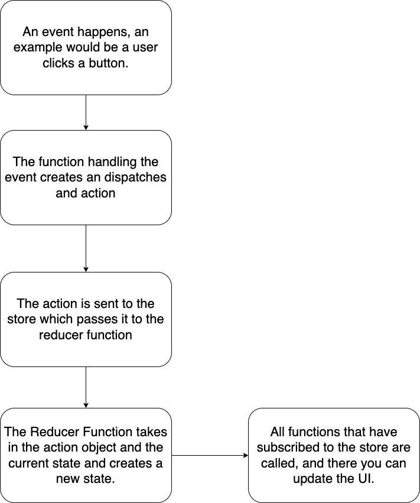

# Redux Toolkit Explain

Redux toolkit is a way to manage global state in your application.  Global meaning that all of your components or javascript can access the state and state meaning the dynamic or changing data in your app.

## Video

<iframe width="560" height="315" src="https://www.youtube.com/embed/TWJvNq5L7SE" title="YouTube video player" frameborder="0" allow="accelerometer; autoplay; clipboard-write; encrypted-media; gyroscope; picture-in-picture" allowfullscreen></iframe>


## [Demo](https://zqu05i.csb.app/)

## [Code](https://codesandbox.io/s/how-redux-works-zqu05i)

## [Presentation](https://docs.google.com/presentation/d/1GwYesy1NuPEwwuaRNdSCsraIMJR2unI_B7ByvBdsudE/edit?usp=sharing)

## Store

A store is the object that contains all of your state data.  It also contains functions to act on that state data.

## Action

An action is a javascript object.  It has two properties.  Type and payload.  The type is a string that tells us what the store should do with the action.  The payload is any extra data the store will need to do action in the type.

```javascript
{
    type: "add_message",
    payload: "Hi Phil"
}
```

## Action Creator

These are functions that return an action.

```javascript
const createMessage = (message) => {
    return {
        type: 'add_message',
        payload: message
    }
}
```

## Initial State

This is the starting state for your application.  It can store any type of value including objects, arrays, boolean, string, numbers, etc.

## Reducer

A reducer is a function that takes in the current state the store is holding and an action.  It will then return a new copy of that state.

```javascript
const initalState = [];
const messages = (state = initalState, action) {
    switch(action.type) {
        case 'add_message':
            return [...state, action.payload];
        default:
            return state;    
    }
}
```

## Redux Flow



1\. An event is trigger in javascript

2\. The function handling the event creates an action.  It will call the dispatch function on the store.

3\. When dispatch function is called which will send action to the store.  

4\. The store will take current state and the action create a new state with the reducer function.

5\. The state will then call all the functions that are subscribe to the store.  Meaning the store keeps a list of function that are to be called when the state changes

6\. In those subscribe function you can call getState to get the current state of the store and update your user interface.

7\. (Optional) If the function subscribing to the store is no longer needed you can call the unsubscribe function.  This function is returned when you pass a function to be subscribe.